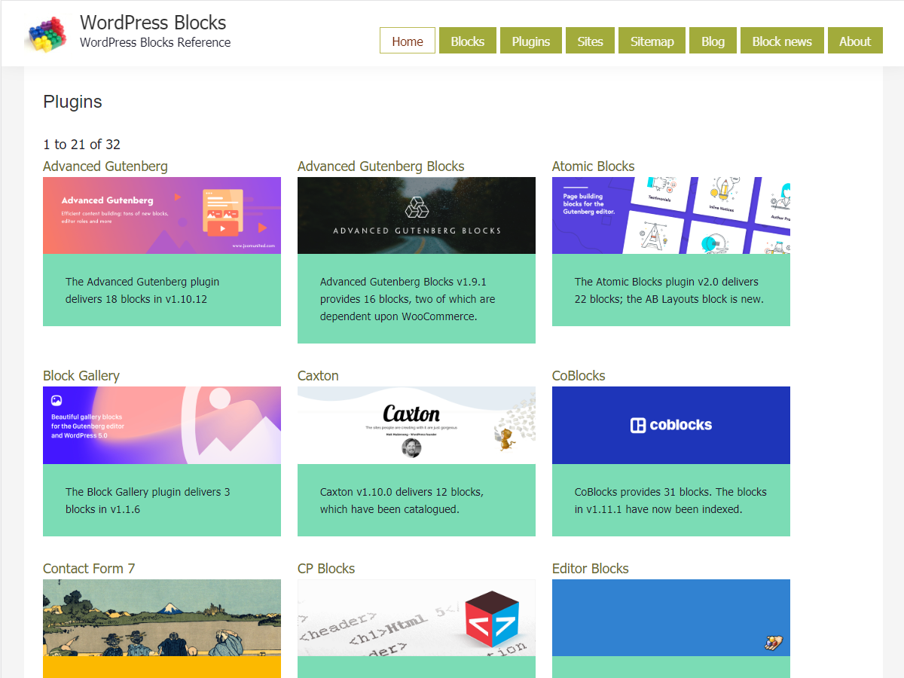

# genesis-a2z 

* Contributors: bobbingwide, vsgloik
* Donate link: https://www.oik-plugins.com/oik/oik-donate/
* Tags: genesis, a2z, one-column, two-columns, sidebars, responsive-layout, accessibility-ready, custom-background, custom-colors, custom-header, custom-menu, editor-style, featured-images, flexible-header, microformats, post-formats, rtl-language-support, sticky-post, threaded-comments
* Requires at least: 5.2.3
* Tested up to: 6.0
* Version: 2.1.0
* License: GPLv2 or later
* License URI: http://www.gnu.org/licenses/gpl-2.0.html

Genesis Child Theme for WP-a2z.org

## Description 
genesis-a2z is a child theme for the Genesis Theme Framework, implemented on WP-a2z.org ( and WP-a2.com )

## Installation 

1. Purchase and Install the Genesis parent theme
2. Download the genesis-a2z child theme
3. Install the genesis-a2z child theme
4. Activate the genesis-a2z child theme
5. Navigate to Appearance > Customize in your admin panel and customize to taste.
6. Navigate to Genesis > Theme Settings to set other options
7. Optionally, install and activate a range of oik-based plugins.

## Change Log 
# 2.1.0 
* Fixed: Don't call add_theme_support('html5') anymore #28
* Changed: Add page_blog.php template - not quite sure why though
* Changed: PHPUnit test with PHPUnit 8 / 9
* Changed: Add support for Columns to the List block
* Changed: Update test for PHP 8 with PHPUnit 9. Check that genesis-a2z is the active child theme.
* Changed: Add support for Columns. Add support for wide and full-wide
* Changed: Add support for Columns to the List block
* Changed: Various improvements: issue #25, issue #27
* Changed: Issue #24 - remove word-wrap: break-word from .site-container
* Changed: Issue #24 - add overflow: auto to .entry-content pre
* Changed: Issue #20 - filter 'Wordpress' to force the lower case p to avoid changing the short description of capital_P_dangit
* Changed: Issue #14 - set list-style-type for .bw_list items in widgets to none
* Changed: Issue #14 - try not using list-style-type for list items and see what happens
* Changed: Issue #19 - Use a full colour palette which includes the 11 default colours, plus Vivid Purple, White and the Link and Accent colours set by the user in the Customizer
* Changed: Issues #8 - improve header styling on iPad landscape
* Tested: With WordPress 6.0 and WordPress Multi Site

# 2.0.0 
* Changed: Eliminate CHILD_THEME_* constants. Update to Genesis 3.1.2,https://github.com/bobbingwide/genesis-a2z/issues/15
* Changed: Update screenshot to show the header and Home page for blocks.wp-a2z.org
* Changed: Enable menu to remain to the right of the title for 1200px width
* Changed: Re-introduce header. Improve header and nav menu styling, https://github.com/bobbingwide/genesis-a2z/issues/18
* Changed: Disable Jetpack contact form.,https://github.com/bobbingwide/genesis-a2z/issues/16
* Changed: Support custom logo in the header to the left of the title and description,https://github.com/bobbingwide/genesis-a2z/issues/18
* Changed: Add top & bottom margin to h2 for block CPT,https://github.com/bobbingwide/genesis-a2z/issues/18
* Tested: With WordPress 5.2.3 and WordPress Multi Site
* Tested: With PHP 7.3

# 1.3.0 
* Changed: Improve display of taxonomy archives - A-Z pagination&comma; sort sequence,https://github.com/bobbingwide/genesis-a2z/issues/4
* Changed: ensure we do display the featured image on taxonomy archives,https://github.com/bobbingwide/genesis-a2z/issues/4

# 1.2.1 
* Changed: Support styling for plugin dependency field

# 1.2.0 
* Changed: Change letter pagination for blocks and block examples, https://github.com/bobbingwide/genesis-a2z/issues/13
* Changed: Improve styling for WordPress 5.0 / Gutenberg, https://github.com/bobbingwide/genesis-a2z/issues/14

# 1.1.0 
* Added: Add Blocks to the A to Z selection list https://github.com/bobbingwide/genesis-a2z/issues/13
* Changed: Improve A to Z styling for iPad. Similar to genesis-oik
* Added: Screenshot at 1200x900
* Added: Add archive templates for oik_api, oik_class and oik_file
* Changed: Change padding and margin to allow for letter taxonomy pagination
* Changed: Copy some templates from genesis-oik issue 5
* Changed: Rename genesis_oik to genesis_a2z  issue 12
* Tested: With Genesis v2.8.0
* Tested: With WordPress 5.0.3
* Tested: With Gutenbeg 4.8.0
* Tested: With PHP 7.2

# 1.0.9 
* Changed: Improve styling of the footer menu
* Fixed: Prevent [edd_register] shortcode from actually completing, https://github.com/bobbingwide/genesis-a2z/issues/10
* Added: Support A to Z pagination https://github.com/bobbingwide/genesis-a2z/issues/5
* Changed: Improve styling and display om archive pages https://github.com/bobbingwide/genesis-a2z/issues/4

# 1.0.8 
* Changed: Improve sidebar widgets width and footer on iPad landscape https://github.com/bobbingwide/genesis-a2z/issues/9
* Changed: Archive and search should display a search form https://github.com/bobbingwide/genesis-a2z/issues/4
* Tested: With WordPress 4.7 and Genesis v2.4.2

# 1.0.7 
* Changed: Improve styling and display on archive pages and lists https://github.com/bobbingwide/genesis-a2z/issues/4
* Fixed: Correct oik-custom.css https://github.com/bobbingwide/genesis-a2z/issues/3

# 1.0.6 
* Changed: v1.0.6 ( not zipped ) for Genesis v2.3.0
* Changed: Various styling improvements - see GitHub log for details

# 1.0.5 
* Changed: Hide the header, mention oik-plugins in the footer, remove breadcrumb prefix
* Changed: Implement some action and filter hooks on 'wp' action
* Changed: Re-add _e_c()
* Changed: Remove extraneous (Edit) link
* Changed: Remove title from page... rely on breadcrumbs
* Changed: Safely expand shortcodes if we can and necessary
* Fixed: Remove call to deleted function _e_c()
* Fixed: Rename some function prefixes to genesis_a2z_ from genesis_oik-
* Fixed: various fixes for single CPT displays

# 1.0.4 
* Added: Add helper routine to create the all post type menu items https://github.com/bobbingwide/genesis-a2z/issues/2
* Added: Enqueue archive.css for archive.php
* Changed: Improve archive layout, sidebar position and some styling
* Changed: Styling for archive pages

# 1.0.3 
* Added: Cloned from genesis-oik v1.0.2 ( 962455c )
* Changed: Make the archive simpler
* Changed: Reduce h2 font for archives
* Deleted: Removed genesis_all logic

# 1.0.2 
* Add: Add temporary workaround for Chrome bug with the admin menu
* Changed: Always display the full sized image in image.php
* Changed: Better support for oik_sc_param
* Fixed: shortcode expansion in footer on 404 page
* Tested: With Genesis v2.1.3 but not Genesis 2.2.x

# 1.0.1 
* Added: jquery-ui.css for use by [bw_accordion] and other jQuery UI components

# 1.0.0 
* Added: First version, child theme of Genesis 2.1.2
* Added: Some styling in style.css copied from oik410130c
* Added: Other styling delivered in oik-custom.css - from oik-plugins.com

## Copyright 
(C) Copyright Bobbing Wide 2015-2022

* This program is free software: you can redistribute it and/or modify
it under the terms of the GNU General Public License as published by
the Free Software Foundation, either version 2 of the License, or
(at your option) any later version.

This program is distributed in the hope that it will be useful,
but WITHOUT ANY WARRANTY; without even the implied warranty of
MERCHANTABILITY or FITNESS FOR A PARTICULAR PURPOSE. See the
GNU General Public License for more details.

genesis-a2z does not bundle third-party resources.

## Notes 
Dependent upon the Genesis Theme Framework, genesis-footer-widgets and other oik plugins.

